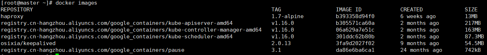

# k8s-ansible
k8s的contoller-manager,scheduler,apiserver核心组件是通过kubelet启动的静态pod来实现的，ansible会把几个组件的安装yaml文件放在/etc/
kubernetes/manifest下面，kubelet启动后会自动安装

## 修改inventory/hosts.ini
我是在virtualbox下安装centos7，用两台机器来安装，注意ip地址，我的虚拟机装了两块网卡，一个是nat模式，网卡为enp0s3, ip为10.0.2.15，一个是bridge模式，网卡为enp0s8，ip为192.168.56.102

nat模式下虚拟机之间网络无法访问，一定要选择bridge的ip，etcd，apiserver，flannel，calico等组件的iface网口一定要设置成enp0s8！

- master 192.168.56.102
- node1 192.168.56.103
```sh
[etcds]
master

[masters]
master

[nodes]
node1

[kube-cluster:children]
nodes
```

时间同步，时区改成上海
```sh
yum -y install ntp
ntpdate time1.aliyun.com
cp /usr/share/zoneinfo/Asia/Shanghai /etc/localtime
```
## 配置roles/cluster-default/defaults/main.yml
如1所述，凡是涉及到iface的地方，都需要改成enp0s8
```sh
# etcd extra variables.
etcd_iface: "enp0s8"
etcd_domain_name: test.etcd.com

# Supported: calico, flannel.
cni_enable: true
container_network: calico
cni_iface: "enp0s8"
```

## 运行cluster-cert
```sh
ansible-playbook -i inventory/hosts.ini cluster-etcd.yml 
```

## 运行cluster-download
因为下载比较费时，单独做了一个task,下载完的文件会放在~/k8s下面
```sh
ansible-playbook -i inventory/hosts.ini cluster-download.yml 
```

## 安装etcd
```sh
ansible-playbook -i inventory/hosts.ini cluster-etcd.yml 
```
`netstat -ntlp`，看到如下host表示安装成功:


etcdctl访问，etcd的证书默认安装在/etc/kubernetes/pki/ectd下
```sh
export ETCDCTL_API=3
etcdctl --cacert=/etc/kubernetes/pki/etcd/etcd-ca.pem --cert=/etc/kubernetes/pki/etcd/etcd.pem --key=/etc/kubernetes/pki/etcd/etcd-key.pem --endpoints=https://192.168.56.102:2379 endpoint health -w=json

# 出现以下表示成功：
https://192.168.56.102:2379 is healthy: successfully committed proposal: took = 707.352µs
```
或者
```sh
curl -s https://192.168.56.102:2379/v2/keys -k --cert /etc/kubernetes/pki/etcd/etcd.pem --key /etc/kubernetes/pki/etcd/etcd-key.pem
```

## 安装cluster-master
!关键的一步，安装master会安装schedler,controller-manager,apiserver,cni等核心组件
```sh
ansible-playbook -i inventory/hosts.ini cluster-master.yml 
```
在安装过程中会出现TASK [k8s-setup : Wait for Kubernetes core component start]，可以通过systemctl stauts kubelet来查看安装状态，

用tail -f /var/log/messages来查看详细日志，我的docker是从阿里云上下的，汇报如下错：

```sh
kubelet cgroup driver: "cgroupfs" is different from docker cgroup driver: "systemd"
```
在每个node节点上，执行：
```sh
export KUBELET_EXTRA_ARGS="--runtime-cgroups=/systemd/system.slice --kubelet-cgroups=/systemd/system.slice --fail-swap-on=false --cgroup-driver=systemd"
```
** kubelet 安装apiserver、cm、scheduler等这些staticpod，以及不断的去请求apiserver的vip是同步进行的，在没有拉起staticpod之前，会一直报错：**


等到拉起staticpod之后就没问题了，但我发现kubelet一直是这个状态，apiserver这些组件的imaeg也都改成国内镜像了，通过在cluster-default/defauts/main.yml里面设置

`kube_image_repo: registry.cn-hangzhou.aliyuncs.com/google_containers`

查看`vim /etc/kubernetes/manifests/kube-apiserver.yml `的kube-apiserver.yml文件

`image: registry.cn-hangzhou.aliyuncs.com/google_containers/kube-apiserver-amd64:v1.16.0`

但还是无法正常拉取镜像，仔细观察/var/log/message里面的日志，发现pause无法拉取


在kubelet启动参数中，增加一下参数，以下参数在ansible已改好，可以直接用
`--pod-infra-container-image=registry.cn-hangzhou.aliyuncs.com/google_containers/pause:3.1`

** 在装master的时候，要把cluster-default/defaults/main.yml下的ha和keepalive打开，kubelet会去找vip，否则会出现找不到apiserver **
```sh
enable_keepalived: true
enable_haproxy: true
vip_interface: "enp0s8"
vip_address: 172.16.35.9
```

在安装过程中，可以随时查看docker拉取镜像的情况，需要等待一些时间



** 注意，kubernetes从v1.16版本后Deployment的apiVersion从extensions/v1beta1改成apps/v1 **
** 如果多次安装，出现证书失败，运行reset-cluster.yml **
** 安装master的时候，通过/var/log/message查看kubelet日志不够详细，要查看apiserver,cm等组件安装时候的日志，进入/var/log/pods/下查看具体日志，类似这种，我在安装的时候apiserver一直没起来，就是通过查看日志，得知证书的问题导致的 **
```
kube-system_kube-apiserver-master_e26006757f58f6bb353eb69a1fc0c573           kube-system_kube-keepalived-master_51e41b396d4d7bb30877543ada243c45
kube-system_kube-controller-manager-master_429bafb765de754f92f0746ea01b0565  kube-system_kube-scheduler-master_77c8fad4cb5614a5503d354951fd0736
kube-system_kube-haproxy-master_2e5ae1209746cceaa8ff7a25d3899eba
```
** kubelet启动可能会遇到多次失败，主要原因在于/usr/lib/systemd/system/kubelet.service 和 /etc/systemd/system/kubelet.service.d/10-kubelet.conf 没有配置好，尤其是参数没有配置好 **

*** 在 /etc/systemd/system/ 目录中的单元文件会和 /usr/lib/systemd/system/ 目录中的同名单元文件进行合并 ***


